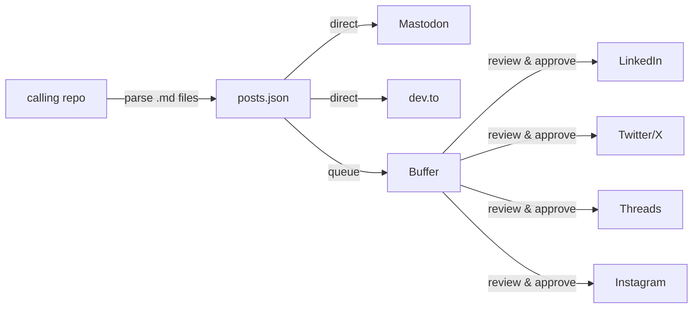
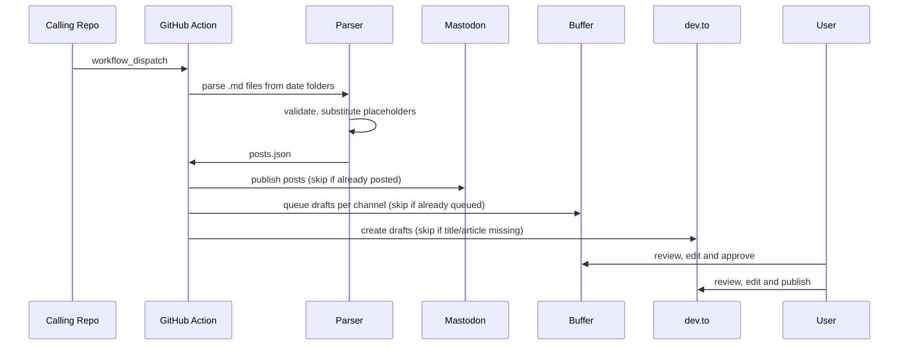

# github-actions-publish

Reusable GitHub Action for cross-posting to Mastodon, Buffer (LinkedIn, Twitter, Threads, Instagram), and dev.to.

## Architecture

The calling repo provides `.md` files and `social.yml`; the parser produces `posts.json`, consumed by the publish scripts:



The full workflow, from trigger to publication:



## Prerequisites

- Python 3 with [PyYAML](https://pypi.org/project/PyYAML/)
- curl
- Accounts and tokens for the platforms you want to publish to:
  - **Mastodon**: access token from Settings > Development > New Application > select read, write and profile
  - **Buffer**: API key from My Organization > Apps & Integrations > API (beta) > + New Key
  - **dev.to**: API key from Settings > Extensions

## Usage

### Quick start

From your repo, run the setup script to generate all required files:

```bash
bash /path/to/github-actions-publish/template/setup.sh \
  --hashtag "#YourHashtag" \
  --content-path events \
  --mastodon-instance https://mastodon.social \
  --buffer \
  --instagram-check \
  --sample 2026-05-20
```

This generates:
- `social.yml` with your configuration
- `.github/workflows/publish.yml` pointing to the latest tag of `bilardi/github-actions-publish`
- `README.md` with usage docs and a `TODO: add description` placeholder
- `LICENSE` (MIT)
- A sample event folder with a template `.md` to fill in (if `--sample`)

If a file already exists, the script asks before overwriting. You can re-run setup to pick up updates (e.g. new workflow version), review the diff, and keep your local changes.

Options:

| Flag | Description |
|------|-------------|
| `--hashtag TEXT` | Fixed hashtag for the repo (required) |
| `--content-path PATH` | Path for date folders (default: `events`) |
| `--mastodon-instance URL` | Mastodon instance URL (default: `https://mastodon.social`) |
| `--mastodon` / `--no-mastodon` | Enable/disable Mastodon (default: enabled) |
| `--buffer` / `--no-buffer` | Enable/disable Buffer (default: enabled) |
| `--devto` / `--no-devto` | Enable/disable dev.to (default: disabled) |
| `--instagram-check` | Enable Instagram aspect ratio check |
| `--sample YYYY-MM-DD` | Create sample event folder with template `.md` |

After setup, add your GitHub secrets and start writing events.

### Setup (manual)

If you prefer to set up manually instead of using `setup.sh`:

#### 1. Create social.yml in your repo

```yaml
hashtag: "#YourHashtag"
content_path: "events"
scan_folders: 3
parser: generic
mastodon:
  instance: https://mastodon.social
  enabled: true
buffer:
  enabled: true
devto:
  enabled: true
instagram_check: false
```

| Field | Required | Description |
|-------|----------|-------------|
| `hashtag` | yes | Fixed hashtag for the repo, added to all posts |
| `content_path` | yes (if generic parser) | Path to date folders |
| `scan_folders` | no (default: 3) | Number of most recent date folders to scan |
| `parser` | no (default: generic) | `generic` or `diary` |
| `mastodon.instance` | yes (if enabled) | Mastodon instance URL |
| `mastodon.enabled` | no (default: false) | Enable Mastodon publishing |
| `buffer.enabled` | no (default: false) | Enable Buffer queuing |
| `devto.enabled` | no (default: false) | Enable dev.to drafts |
| `instagram_check` | no (default: false) | Validate image aspect ratio (16:9) |

#### 2. Add GitHub secrets

| Secret | Used by |
|--------|---------|
| `MASTODON_ACCESS_TOKEN` | Mastodon direct publishing |
| `BUFFER_ACCESS_TOKEN` | Buffer draft queuing |
| `DEV_TO_API_KEY` | dev.to draft creation |

Each repo uses its own accounts and tokens.

#### 3. Create the workflow in your repo

```yaml
# .github/workflows/publish.yml
name: Publish posts
on:
  workflow_dispatch:
jobs:
  publish:
    uses: bilardi/github-actions-publish/.github/workflows/publish.yml@v0.1.0
    secrets:
      MASTODON_ACCESS_TOKEN: ${{ secrets.MASTODON_ACCESS_TOKEN }}
      BUFFER_ACCESS_TOKEN: ${{ secrets.BUFFER_ACCESS_TOKEN }}
      DEV_TO_API_KEY: ${{ secrets.DEV_TO_API_KEY }}
```

### File format

Organize content in date folders under `content_path`:

```
events/
  2026-04-15/
    pre.md
    post.md
  2026-05-20/
    recap.md
```

- Folder name must be a date (`YYYY-MM-DD`)
- Any `.md` file in the folder is a post (name and language don't matter)
- Non-`.md` files are ignored
- `.md` files without the expected format cause an error

Post format:

```markdown
---
title: "Event Title"
date: 2026-04-10
images:
  - https://example.com/image1.jpg
  - https://example.com/image2.jpg
url: https://www.meetup.com/your-event/123
tags: [python, venice]
---

# long

Long text for LinkedIn and Instagram (up to 3.000 chars).
Multi-line, easy to write.

{url}

{hashtag} {tags}

# medium

Shorter text for Mastodon and Threads (up to 500 chars).

{url}

{hashtag} {tags}

# short

Short text for Twitter (< 280 chars) {url} {hashtag} {tags}

# article

## Introduction

Full article for dev.to, free-form markdown (use ## or lower headings).
```

Google Drive images: you can paste the share link directly (e.g. `https://drive.google.com/file/d/FILE_ID/view`); the parser converts it to a thumbnail URL (`drive.google.com/thumbnail?id=...&sz=w1920`) automatically.

Frontmatter fields:

| Field | Required | Description |
|-------|----------|-------------|
| `title` | no | Used only by dev.to. Skipped with warning if missing and devto enabled |
| `date` | yes | Social publication date (`YYYY-MM-DD`). Error if missing |
| `images` | yes (min 1) | List of image URLs (max 4). Passed to Mastodon and Buffer |
| `url` | yes | Link to the resource. Used for dedup and `{url}` placeholder |
| `tags` | yes (min 1) | Tag list, converted to hashtags. Words are fine without quotes (`[Networking, Serverless]`); numbers need quotes (`["14"]`); special characters need quotes (`["C#", ".NET"]`) |

Sections (all optional; the publish scripts validate at runtime based on active channels):

| Section | Used by | Error if missing and... |
|---------|---------|------------------------|
| `# long` | LinkedIn, Instagram (via Buffer) | LinkedIn or Instagram channel active |
| `# medium` | Mastodon, Threads (via Buffer) | Mastodon enabled or Threads channel active |
| `# short` | Twitter (via Buffer) | Twitter channel active |
| `# article` | dev.to | dev.to enabled (skip with warning) |

### Placeholders

| Placeholder | Replaced with |
|-------------|---------------|
| `{url}` | `url` value from frontmatter |
| `{hashtag}` | Fixed hashtag from `social.yml` |
| `{tags}` | Tags converted to hashtags (#python #venice) |

Place them wherever you want in the text.
- If `{hashtag}` is not in the text, it is prepended to `{tags}`
- If `{tags}` is not in the text, it is appended at the end
- If the fixed hashtag is already written literally (e.g. `#PyVenice`), it is not duplicated
- If a tag is already written literally (e.g. `#python`), it is not duplicated (whole-word match)

### Publication logic

- **Trigger**: manual (`workflow_dispatch`)
- **Most recent N date folders** are scanned, controlled by `scan_folders` in `social.yml` (default: 3)
- **File date >= today (UTC)**: publishes (if not already posted)
- **File date < today**: skipped
- **File date missing**: error
- **Dedup**: checks if `url` is already in recent Mastodon statuses or Buffer posts (per-channel)

### Images and Instagram

- Mastodon: uploads up to 4 images per post
- Buffer: passes all images (carousel for Instagram, LinkedIn, Twitter)
- With `instagram_check: true`: validates aspect ratio before publishing, warns if not 16:9
- Constraints: images < 8MB, formats JPG/PNG/GIF/HEIC

## Troubleshooting

### Workflow not appearing in the Actions tab

For private repos in some GitHub Free organizations, the calling `publish.yml` may not register: the Actions tab stays empty and `gh api repos/<owner>/<repo>/actions/workflows` returns `total_count: 0`. Setting the repo visibility to public unblocks the registration. To confirm the cause before changing visibility, push a minimal non-reusable workflow (with `runs-on: ubuntu-latest` and `steps:`); if that one registers but the calling workflow does not, the org is blocking calls to external reusable workflows on private repos specifically.

Note: changing visibility alone does not re-validate existing workflow files. After going public, push a small change to `.github/workflows/publish.yml` (e.g., a trailing newline: `echo "" >> .github/workflows/publish.yml`) to force GitHub to revalidate and register it.

Note: GitHub may also fail to register a workflow when it is included in the very first push to the repository, even on public repos. Symptom: `gh api repos/<owner>/<repo>/actions/workflows` returns `total_count: 0` even though `.github/workflows/publish.yml` is on the default branch. Workaround: push the initial repo without `.github/workflows/`, then add the workflow in a second commit and push. If the workflow has already been pushed in the initial commit and is not appearing, push a small change to it (e.g., add a comment line) to force GitHub to validate and register it.

## Project structure

```
.github/workflows/
  publish.yml  # reusable workflow (workflow_call)
scripts/
  parse-generic.py  # parser: .md files -> posts.json
  parse-generic.sh  # bash wrapper for the parser
  mastodon-publish.sh  # publish to Mastodon from posts.json
  buffer-publish.sh  # queue to Buffer from posts.json
  devto-publish.sh  # create dev.to drafts from posts.json
  check-length.sh  # check character counts per section
template/
  setup.sh  # setup script for calling repos
  event.md  # skeleton .md for new events
tests/
  fixtures/  # sample social.yml and .md files
  test-parser.sh  # parser integration tests
docs/
  diary-migration.md  # guide for migrating diary to this workflow
  superpowers/specs/  # design spec
  superpowers/plans/  # implementation plan
POST.md  # blog post (Italian, collected by diary)
TODO.md  # next steps
README.md  # this file
LICENSE  # MIT license
```

## Development

Run parser tests:

```bash
pip install pyyaml
bash tests/test-parser.sh
```

Check character counts for a post (run from the calling repo root, where `social.yml` is):

```bash
bash /path/to/github-actions-publish/scripts/check-length.sh events/2026-05-20/pre.md
```

Shows raw and adjusted counts (URLs counted as 23 chars, like Mastodon/Twitter). Exit code 1 if any section exceeds the limit.

Test publish scripts with dry-run (requires `posts.json` and `social.yml` in the current directory):

```bash
DRY_RUN=true MASTODON_ACCESS_TOKEN=test bash scripts/mastodon-publish.sh
DRY_RUN=true BUFFER_ACCESS_TOKEN=test bash scripts/buffer-publish.sh
DRY_RUN=true DEV_TO_API_KEY=test bash scripts/devto-publish.sh
```

Versioning follows semver. Calling repos point to a specific tag:

```yaml
uses: bilardi/github-actions-publish/.github/workflows/publish.yml@v0.1.0
```

To release a new version (requires [git-cliff](https://git-cliff.org) in PATH; install with `uv tool install git-cliff` or `cargo install git-cliff`):

1. Modify scripts, run tests
2. Run `make patch` (or `make minor` / `make major`): bumps the tag from the latest one, regenerates `CHANGELOG.md` from conventional commits, commits with `chore: release vX.Y.Z`, tags, and pushes.
3. Calling repos update the tag in their workflow when ready (or re-run `template/setup.sh`, which auto-detects the latest tag).

## Blog post

- [POST.it.md](POST.it.md)
- [POST.en.md](POST.en.md)

## License

This repo is released under the MIT license. See [LICENSE](LICENSE) for details.
